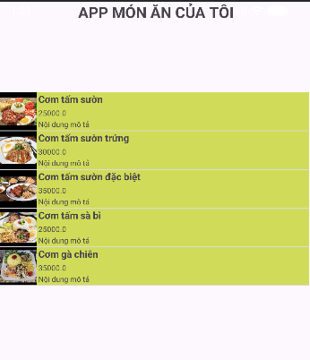
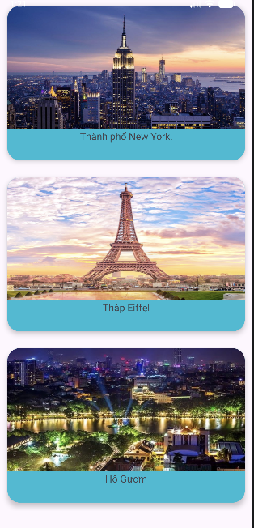
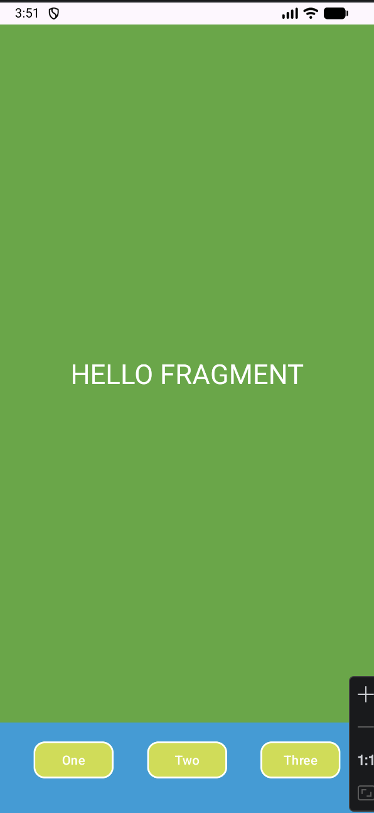

# 65130734-AndroidProgramming

This is where I learned about Android programming

Kết quả của bài thực hành số 8:

  

Kết quả của bài thực hành số 9:

  

Kết quả bài thực hành số 11: Ví dụ về bài Fragment Statically.

  

